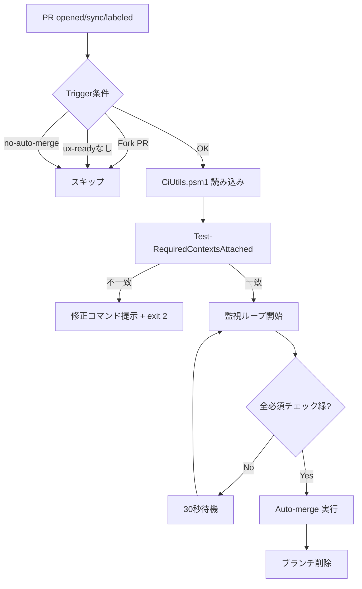

# CI Auto-Merge Operator

安全な PR 自動マージシステム - ラベルベースの制御と多層防御

## 🎯 概要

このシステムは、必須チェックが緑になった PR を **人間の判断を尊重しながら** 自動的にマージします。

### 主な特徴

- ✅ **ラベルベース起動**: `ux-ready` ラベルで明示的に有効化
- 🛑 **非常停止機能**: `no-auto-merge` ラベルで即座に停止
- 🔒 **フォーク保護**: 外部フォーク由来の PR は自動実行対象外
- 🔐 **最小権限**: `contents:write`, `pull-requests:write`, `checks:read` のみ
- 🚦 **排他制御**: PR 単位で単一路線、多重マージを防止
- 📊 **整合性チェック**: required contexts と実チェック名の一致を検証

## 🚀 使い方

### 1. 基本的な使い方（推奨）

```powershell
# PR に ux-ready ラベルを付与 + Auto-merge 有効化
.\scripts\enable-automerge.ps1 -Pr 149
```

これだけで以下が自動実行されます:
1. `ux-ready` ラベル付与（ワークフロートリガー）
2. GitHub Auto-merge 有効化（squash + delete-branch）
3. 必須チェックの状態確認

### 2. 手動での GitHub CLI 操作

```powershell
# ラベル付与
gh pr edit 149 --add-label 'ux-ready'

# Auto-merge 有効化
gh pr merge 149 --auto --squash --delete-branch
```

### 3. 非常停止（マージを止めたい場合）

```powershell
# no-auto-merge ラベルを付与
gh pr edit 149 --add-label 'no-auto-merge'

# または ux-ready ラベルを削除
gh pr edit 149 --remove-label 'ux-ready'
```

## 🔍 検証ツール

### ブランチ保護整合性チェック

```powershell
# 最新の PR で検証
.\scripts\validate-branch-protection.ps1

# 特定の PR で検証
.\scripts\validate-branch-protection.ps1 -PrNumber 149

# 不一致を自動修正
.\scripts\validate-branch-protection.ps1 -PrNumber 149 -AutoFix
```

このスクリプトは以下を確認します:
- `main` ブランチの required status checks
- 実際の check-runs 名
- 不一致があれば修正コマンドを提示

## 📋 前提条件

### リポジトリ設定

1. **Auto-merge の許可**
   - Settings → General → Pull Requests
   - ✅ Allow auto-merge

2. **ブランチ保護（main）**
   - Settings → Branches → main → Edit
   - ✅ Require status checks to pass before merging
   - Required checks:
     - `SonarCloud Code Analysis`
     - `Vercel Preview Comments`

3. **必須ラベル**
   - `ux-ready`: Auto-merge を有効化するトリガー
   - `no-auto-merge`: 非常停止用（オプション）

### ローカル環境

```powershell
# GitHub CLI インストール確認
gh --version

# 認証
gh auth login

# または環境変数
$env:GH_TOKEN = "ghp_xxxx..."
```

## 🔄 ワークフローの動作



### トリガー条件

ワークフローは以下の条件で実行されます:

```yaml
if: >
  (フォーク由来でない) AND
  (workflow_dispatch OR (
    ux-ready ラベル付与 AND
    no-auto-merge ラベル未付与
  ))
```

## 🛠️ トラブルシューティング

### ワークフローが起動しない

```powershell
# ラベル確認
gh pr view 149 --json labels --jq '.labels[].name'

# ワークフロー実行履歴
gh run list --workflow=ci-automerge.yml --limit 5
```

**確認ポイント:**
- ✅ `ux-ready` ラベルが付与されているか
- ✅ `no-auto-merge` ラベルが付与されていないか
- ✅ PR がフォーク由来でないか

### Auto-merge が有効化できない

```powershell
# リポジトリ設定確認
gh api repos/{owner}/{repo} --jq '.allow_auto_merge'
# → true であること
```

### Required contexts の不一致

```powershell
# 整合性チェック実行
.\scripts\validate-branch-protection.ps1 -AutoFix
```

## 📚 リファレンス

### コアモジュール: CiUtils.psm1

| 関数 | 説明 |
|------|------|
| `Get-RepoSlug` | owner/repo 形式のスラッグ取得 |
| `Get-PrInfo` | PR 情報取得（statusCheckRollup 正規化） |
| `Get-RequiredContexts` | main の required contexts 取得 |
| `Get-ActualCheckNames` | **実チェック名取得**（Checks API） |
| `Test-RequiredContextsAttached` | **整合性検証**（required vs actual） |
| `Get-ActualContexts` | Status API + Checks API 結合 |
| `Push-EmptyCommit` | 空コミットプッシュ |
| `Get-ActionRunsForPr` | ワークフロー実行一覧 |
| `Invoke-ActionRunRerun` | ワークフロー再実行 |
| `Invoke-CheckSuiteRerequest` | Check Suite 再リクエスト |
| `Test-AllRequiredChecksGreen` | 全必須チェック成功確認 |

### 主要スクリプト

| ファイル | 用途 |
|----------|------|
| `ci_automerge.ps1` | 自動マージ監視スクリプト（ワークフローから起動） |
| `enable-automerge.ps1` | **運用補助**: ワンコマンドでラベル+Auto-merge設定 |
| `validate-branch-protection.ps1` | **整合性チェック**: required contexts 検証 |

## 🔐 セキュリティ設計

### 1. Fork PR 保護

```yaml
if: >
  github.event.pull_request.head.repo.full_name == github.repository
```

外部フォーク由来の PR では Secrets が露出しないよう、`pull_request` トリガーを使用し、
フォーク由来を明示的に除外しています。

**参考**: [GitHub Security Guides - Using secrets in GitHub Actions](https://docs.github.com/en/actions/security-guides/using-secrets-in-github-actions)

### 2. 最小権限

```yaml
permissions:
  contents: write          # マージ操作
  pull-requests: write     # PR ステータス更新
  checks: read             # チェック参照のみ
```

**参考**: [Automatic token authentication](https://docs.github.com/en/actions/security-guides/automatic-token-authentication#permissions-for-the-github_token)

### 3. ラベルベース制御

- `ux-ready`: 明示的な起動（誤作動防止）
- `no-auto-merge`: 人間の最終判断を尊重

### 4. Concurrency 制御

```yaml
concurrency:
  group: ${{ github.workflow }}-${{ github.event.pull_request.number }}
  cancel-in-progress: true
```

PR 単位で排他制御、多重マージ事故を防止。

**参考**: [Using concurrency](https://docs.github.com/en/actions/using-jobs/using-concurrency)

## 🚦 運用ポリシー例

### パターン1: 厳格運用

```yaml
# ux-ready ラベル必須 + レビュー承認必須
if: >
  contains(..., 'ux-ready') &&
  !contains(..., 'no-auto-merge') &&
  github.event.pull_request.reviews_count > 0
```

### パターン2: Dependabot 自動化

```yaml
# dependabot PRは自動マージ（minor/patchのみ）
if: >
  github.actor == 'dependabot[bot]' &&
  contains(github.event.pull_request.title, 'bump') &&
  !contains(github.event.pull_request.title, 'major')
```

### パターン3: Merge Queue 併用

Settings → Branches → main で Merge queue を有効化すると、
競合する PR も安全に直列化してマージできます。

**参考**: [Managing a merge queue](https://docs.github.com/en/repositories/configuring-branches-and-merges-in-your-repository/configuring-pull-request-merges/managing-a-merge-queue)

## 📖 関連ドキュメント

- [Automatically merging a pull request](https://docs.github.com/en/pull-requests/collaborating-with-pull-requests/incorporating-changes-from-a-pull-request/automatically-merging-a-pull-request)
- [GitHub CLI - gh pr merge](https://cli.github.com/manual/gh_pr_merge)
- [Branch protection API](https://docs.github.com/en/rest/branches/branch-protection)
- [Check Runs API](https://docs.github.com/en/rest/checks/runs)
- [GitHub Actions concurrency](https://docs.github.com/en/actions/using-jobs/using-concurrency)

## 🎓 Tips

### 失敗したチェックの再実行

```powershell
# ワークフロー再実行
gh run rerun <run-id> --failed

# Check Suite 再リクエスト
Import-Module .\scripts\modules\CiUtils.psm1
Invoke-CheckSuiteRerequest -PrNumber 149 -AppSlug "github-actions"
```

### ラベルの一括管理

```powershell
# 複数PRにux-readyを付与
149,148,147 | ForEach-Object {
    gh pr edit $_ --add-label 'ux-ready'
}
```

### 定期的な整合性チェック（Scheduled workflow）

```yaml
# .github/workflows/scheduled-validation.yml
on:
  schedule:
    - cron: '0 0 * * 0'  # 毎週日曜 0:00

jobs:
  validate:
    runs-on: ubuntu-latest
    steps:
      - uses: actions/checkout@v4
      - run: .\scripts\validate-branch-protection.ps1 -AutoFix
```

---

**Status**: ✅ Production Ready

**Last Updated**: 2025-01-12

**Maintained by**: DevOps Team
